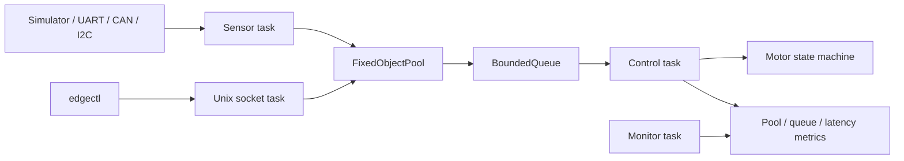
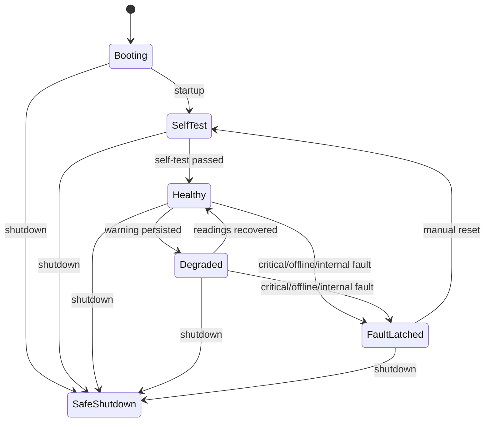

# EdgeSentinel

[](https://github.com/wu040125/Embedded-state-machines-and-multi-threaded-memory-management-systems/actions/workflows/ci.yml)

EdgeSentinel is a personal C++20/Linux learning project that simulates an industrial motor health monitor and fail-safe controller. It combines a fixed-capacity event pipeline, a deterministic protection state machine, four cooperating tasks, local Unix socket control, and Linux UART/SocketCAN/I2C adapters.

[中文说明](README.zh-CN.md) · [中文学习文档](docs/zh-CN/README.md)

> This repository is an edge-controller simulation, not a production deployment. The simulator, protocol codecs, state machine, memory pool, and Linux IPC path are automatically tested. Physical UART, CAN, I2C devices and a real motor have not been used for validation.

## What it demonstrates

- C++20 RAII, move-only ownership, templates, `std::jthread`, `std::stop_token`, `std::span`, and `std::from_chars`.
- A thread-safe fixed object pool with alignment, statistics, exhaustion handling, invalid-release detection, and RAII handles.
- A fixed-capacity multi-producer queue with backpressure and explicit close semantics.
- An event-driven motor protection state machine with hysteresis, consecutive-sample filtering, latched faults, manual reset, and safe shutdown.
- Sensor, control, monitor, and Unix-domain-socket communication tasks with clear state ownership.
- A CRC16 UART protocol, SocketCAN message mapping, and an I2C register map with Linux adapters.
- GCC, Clang, ASan/UBSan, TSan, unit tests, an IPC end-to-end test, and a repeatable event-pipeline benchmark.

## Architecture



Only the control task mutates the state machine. Producers allocate an event from the fixed pool, transfer its move-only handle through the bounded queue, and let RAII return the block after consumption.

## State model



## Build and run

Ubuntu 24.04 or another recent Linux distribution:

```bash
sudo apt update
sudo apt install -y build-essential cmake ninja-build
./scripts/build_ubuntu.sh
./scripts/run_demo.sh
```

Manual daemon session:

```bash
cmake --preset linux-gcc-debug
cmake --build --preset linux-gcc-debug

./out/build/linux-gcc-debug/edge_sentinel_daemon
./out/build/linux-gcc-debug/edgectl status
./out/build/linux-gcc-debug/edgectl inject temperature 105
sleep 0.5
./out/build/linux-gcc-debug/edgectl status
./out/build/linux-gcc-debug/edgectl metrics
./out/build/linux-gcc-debug/edgectl clear
./out/build/linux-gcc-debug/edgectl reset
./out/build/linux-gcc-debug/edgectl shutdown
```

On Windows with Visual Studio 2026:

```powershell
cmake --preset windows-msvc-debug
cmake --build --preset windows-msvc-debug
ctest --preset windows-msvc-debug
./out/build/windows-msvc-debug/Debug/edge_sentinel.exe --duration-ms 3000 --fault-after-ms 1000
```

## Benchmark

```bash
./out/build/linux-gcc-debug/edge_sentinel_benchmark
```

The benchmark reports throughput, average/P50/P95/P99/max queue latency, pool and queue high-water marks, and allocation failures. Results depend on compiler, build type, CPU, scheduler, and load, so the repository does not present one local Debug run as a universal result.

## Hardware-facing status

| Path | Implementation | Validation level |
|---|---|---|
| Simulator | Deterministic in-process source and fault injection | Unit + runtime + IPC E2E |
| UART | CRC16 codec and Linux `termios` adapter | Codec tested; Linux adapter compiled |
| CAN | CAN-ID mapping and Linux SocketCAN adapter | Mapping tested; adapter compiled; `vcan` guide included |
| I2C | Register decoder and Linux `i2c-dev` combined transaction | Decoder tested; adapter compiled |
| Physical devices | Replace the `ISensorSource` implementation | Not yet validated |

## Repository guide

- `include/edge_sentinel/memory`: fixed object pool and RAII handle.
- `include/edge_sentinel/concurrency`: bounded thread-safe ring queue.
- `include/edge_sentinel/fsm`: motor protection state machine.
- `include/edge_sentinel/runtime`: task lifecycle and metrics.
- `include/edge_sentinel/protocols`: portable UART/CAN/I2C protocol logic.
- `src/linux`: Unix socket and Linux device adapters.
- `tests`: executable specifications for each module.
- `docs/zh-CN`: learning notes and interview-oriented walkthroughs.

## Quality gates

GitHub Actions builds with GCC and Clang using strict warnings, runs all tests, exercises the daemon and `edgectl`, and runs separate ASan/UBSan and TSan jobs. See the CI badge for the current result.

## License

MIT. See [LICENSE](LICENSE).
